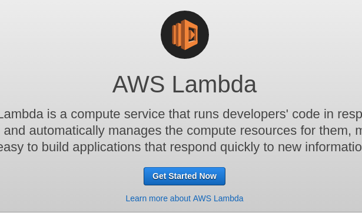
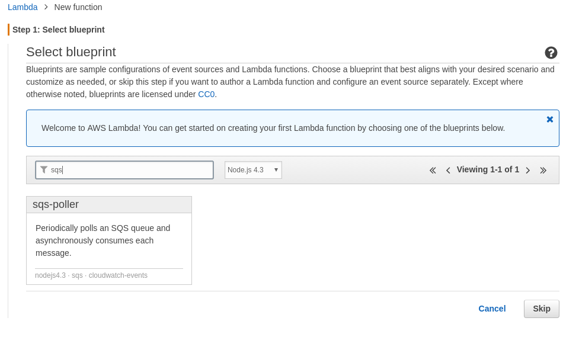
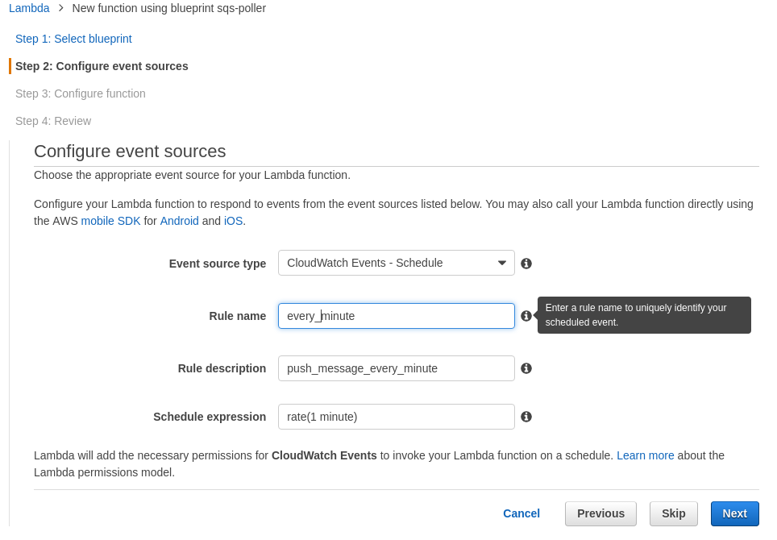
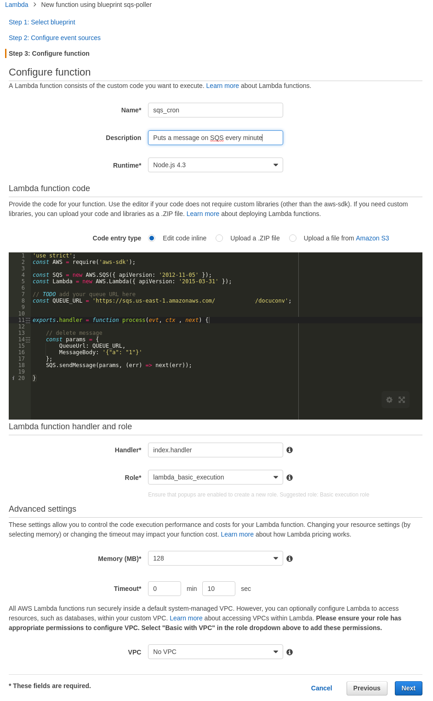
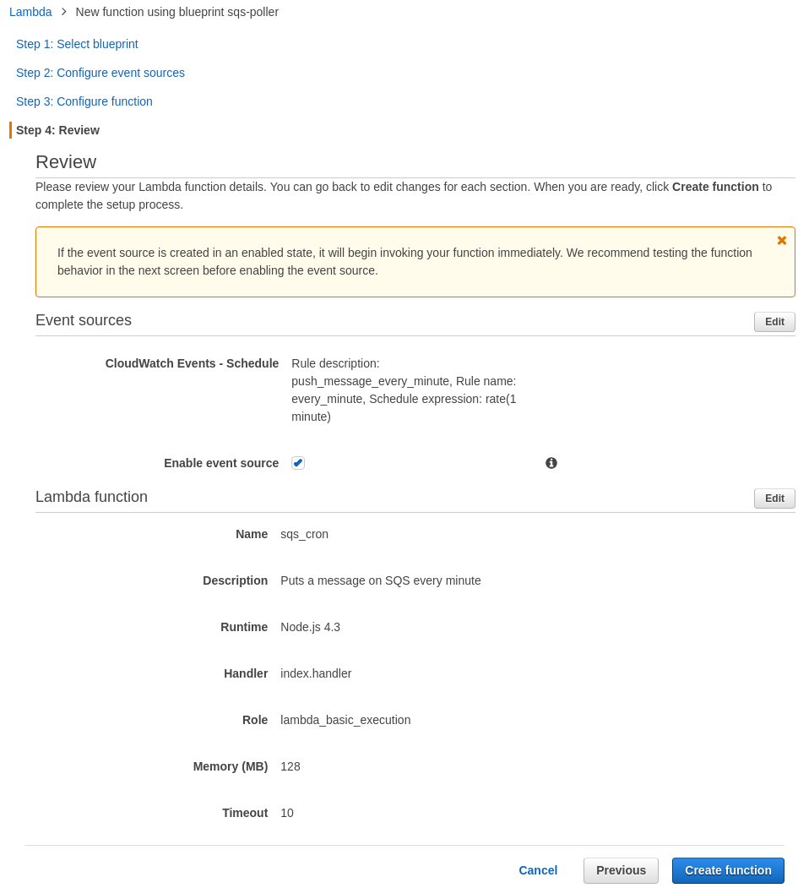
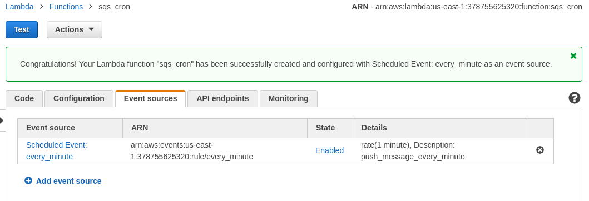

# Replacing Cron with AWS Lamda

We're running a mix of [AWS Elastic Beanstalk](https://aws.amazon.com/elasticbeanstalk/) along with some random [EC2's](https://aws.amazon.com/ec2/), [SQS](https://aws.amazon.com/sqs/), [RDS](https://aws.amazon.com/rds/) and a few other things at work.

Currently we have some [CRON](https://en.wikipedia.org/wiki/Cron) running on these EC2's which bothers me as if these servers fail we need to re-instate it. Sure we are using [Ansible](https://www.ansible.com/) to make re-installation a breeze but it still doesn't feel right to me and we're probably spending a bit too much money because these servers are idle while they're not doing their timed tasks.

So recently I have attended a few talks at [LNUG](http://lnug.org) about Lambda and decided my weekend investigation should be to see if I could get Lamda running Cron related tasks.

I did the pointy clicky process in the [AWS console](https://aws.amazon.com/console/) and had a Lamda putting items into an SQS queue... It was pretty easy and it worked... Awesome!

I'm going to come back and show you how to do this in a proper [idempotent](http://stackoverflow.com/questions/1077412/what-is-an-idempotent-operation) way but firstly this is how you do it in the UI.

## Manual Version

### Getting Started

Firstly click the "Get Started Now" button on the initial Lambda screen (the image at the top of the screen), this will take you into a simple wizard like interface as seen below.

### Picking a BluePrint

We use a lot of SQS queues and I think that putting an item onto a queue would be better than a HTTP request as if the scheduled item fails to be called or times out the item will stay in the queue and we will notice. Therefore I picked something that would bring in the required AWS libraries as a starting point.

### Scheduling

This is where the Cron bit comes in, note the fact it comes from Cloudwatch that is important later. You can put full Cron lines in there but the syntax is [slightly strange](https://docs.aws.amazon.com/AmazonCloudWatch/latest/DeveloperGuide/ScheduledEvents.html#CronExpressions)

### The Code

Now we get to write some code. There is support for rudimentary testing etc, but I wouldn't want to do development here... I read breifly about the "Role" and it sounds really interesting but it is a bit too opaque for me right now to write about it... Did you notice there are no credentials for writing to the SQS queue? For the time being I just created one based on "Basic execution role"

### Ready to Deploy!

## The Automated Way.

### The tools

After my investigations into [HashiCorp's Terraform](http://www.terraform.io/) I became a real fan and I saw that Terraform includes a bunch of functions related to Lamda, getting them going took a little bit of experimentation however...

### The problems

My biggest problem was that I associated the scheduled running of a Lambda with the Lambda product itself as you configure it in the wizard. Seems this is not really the case and attempting to use [`aws_lambda_event_source_mapping`](https://www.terraform.io/docs/providers/aws/r/lambda_event_source_mapping.html) got me nowhere.

### The solution

Eventually I found that the schedule exists in Cloudwatch, which seems a bit non-obvious to me but in any case once I found this out I started exploring Terraform's [`aws_cloudwatch_event_rule`](https://www.terraform.io/docs/providers/aws/r/cloudwatch_event_rule.html) and [`aws_cloudwatch_event_target`](https://www.terraform.io/docs/providers/aws/r/cloudwatch_event_rule.html) as a way to fire the function. It turned out that no matter what I could do I could not get it to show in "Event Sources" in the console as shown below:

The missing part of the puzzle was permissions in the form of [`aws_lambda_permission`](https://www.terraform.io/docs/providers/aws/r/lambda_permission.html) and once I added this it all worked well and items were appearing in my SQS queue.

### What I achieved

Seems my weekend work has acheived something awesome as:

 * We can now remove an instance that just runs Cron, saving a small amount of money and saving the planet.
 * We've given the job of ensuring it all keeps running to AWS so we no longer need to worry so much about the Cron machine going down and us not noticing.

### Where's the source?

The source for everything is on [GitHub](https://github.com/forbesmyester/aws-lambda-cron).
